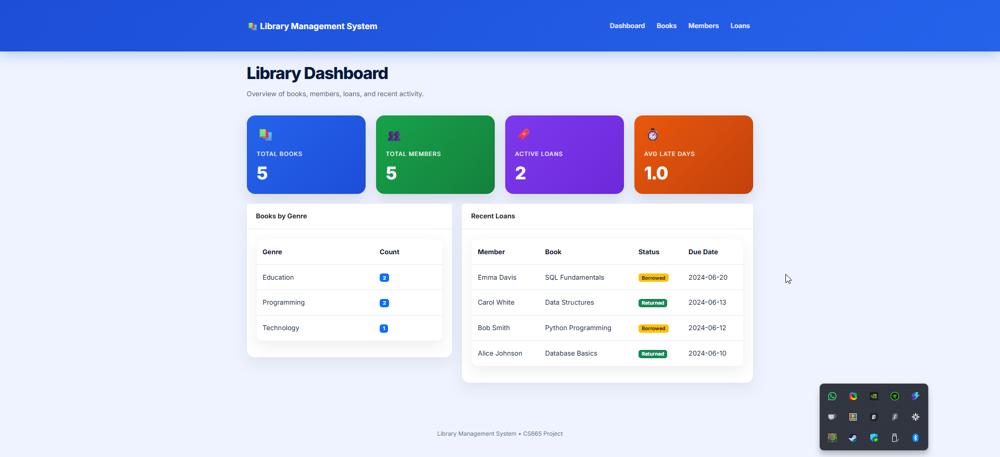
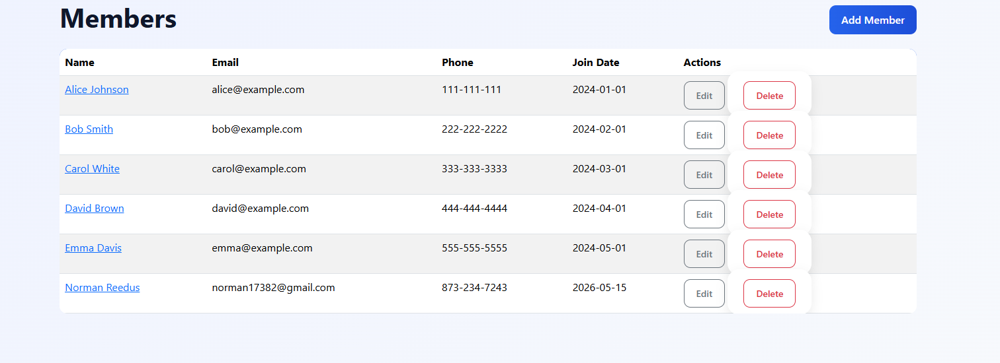
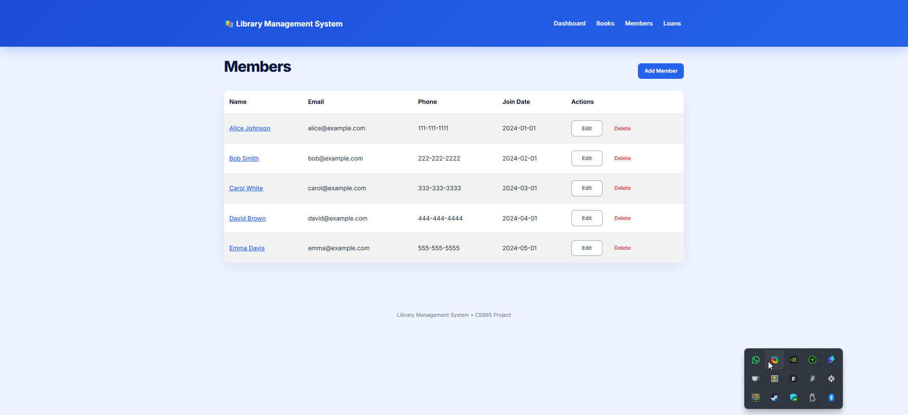
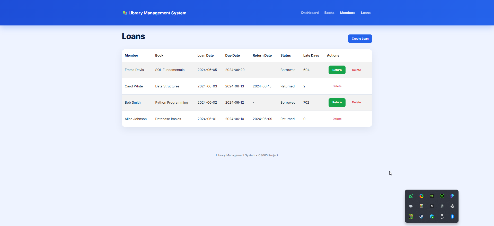

# 📚 Library Management System

## 📖 Project Description

This project is a web-based Library Management System developed using Python and Flask. The application is designed to help manage books, library members, and loan records using a relational database.

The system supports CRUD operations, relationship handling between tables, transaction logic for loans, server-side validation, and a dashboard displaying summary statistics.

---

## ✨ Key Features

### 📚 Library Book Management
- Add, update, and delete books
- Store book metadata such as ISBN, author, genre, and publication date

### 👥 Member Management
- Manage member records and contact details
- Maintain unique member entries

### 🔖 Loan Tracking
- Create and manage book loans
- Prevent unavailable books from being borrowed again
- Track return status and overdue records

### 📊 Dashboard Analytics
- Display aggregate statistics using SQL functions
- Show total books, members, loans, and late return averages

### ✅ Validation and Integrity
- Server-side validation for required fields
- SQL constraints for data integrity
- Relational schema normalized to 3NF

---

## 🛠️ Technologies Used

- Python 3
- Flask
- SQLite
- SQLAlchemy
- HTML5
- CSS3
- Bootstrap
- Jinja2 Templates
- Git & GitHub

---

## 📂 Project Structure

```text
Library-Management-System/
│
├── app.py
├── requirements.txt
├── final_schema.sql
├── AI_LOG.md
├── NORMALIZATION.md
├── README.md
├── run_project.bat
│
├── templates/
│   ├── base.html
│   ├── dashboard.html
│   ├── books.html
│   ├── members.html
│   ├── loans.html
│   └── forms/
│
├── static/
│   └── css/
│       └── style.css
│
└── screenshots/
```

---

## ⚙️ Installation Instructions

## 🚀 Quick Start (Windows)

Windows users can run the application directly using:

```text
run_project.bat
```

This automatically:
- creates the virtual environment
- installs dependencies
- creates the database if needed
- starts the Flask server
- opens the application in the browser

---

## 🐍 Python Requirement

Python 3 must be installed before running the project.

Download Python from:

https://www.python.org/downloads/

During installation, make sure to enable:

```text
Add Python to PATH
```

---

## ⚙️ Manual Installation

### 1. Clone the Repository

```bash
git clone https://github.com/Gungn1r-G/Library-Management-System.git
cd Library-Management-System
```

### 2. Create Virtual Environment

Windows:

```bash
python -m venv venv
```

Mac/Linux:

```bash
python3 -m venv venv
```

### 3. Activate Virtual Environment

Windows PowerShell:

```powershell
Set-ExecutionPolicy -Scope Process -ExecutionPolicy Bypass
.\venv\Scripts\Activate.ps1
```

Windows Command Prompt:

```cmd
venv\Scripts\activate.bat
```

Mac/Linux:

```bash
source venv/bin/activate
```

### 4. Install Dependencies

```bash
pip install -r requirements.txt
```

---

## 💾 Database Setup

The SQL schema file included in the project is:

```text
final_schema.sql
```

If the `library.db` file already exists, the project can usually be started immediately after installing dependencies.

To create the database manually from the schema file:

Start Python:

```bash
python
```

Then run:

```python
import sqlite3

conn = sqlite3.connect("library.db")

with open("final_schema.sql") as f:
    conn.executescript(f.read())

conn.commit()
conn.close()

exit()
```

---

## ▶️ Running the Application

Start the Flask server:

```bash
python app.py
```

Open the application in a browser:

```text
http://127.0.0.1:5000
```

---

## 🧭 Application Navigation

### 📊 Dashboard
View summary statistics for books, members, and active loans.

### 📚 Books
Add, edit, update, and delete books.

### 👥 Members
Manage library member records.

### 🔖 Loans
Create and view book loan records.

---

## 🔒 Validation and Transactions

- Empty fields are restricted through server-side validation.
- Loan transactions update book availability when a loan is created.
- Unavailable books cannot be loaned again until returned.
- SQL constraints help maintain relational data integrity.

---

## 📁 Additional Files

- `NORMALIZATION.md` → 3NF normalization report
- `AI_LOG.md` → AI usage disclosure
- `final_schema.sql` → final relational database schema

---

## 🖼️ Screenshots

### 📊 Dashboard



---

### 📚 Books Page



---

### 👥 Members Page



---

### 🔖 Loans Page



---

## 🔮 Future Improvements

Possible future enhancements include:
- Search and filtering functionality
- Authentication and login system
- Exporting reports to CSV or PDF
- REST API support
- Role-based access control
- Advanced analytics and reporting

---

## 📝 Notes

The `.gitignore` file excludes unnecessary folders such as:

```text
venv/
__pycache__/
.env
library.db
```

---

Developed as part of the CS665 Database Application Project.